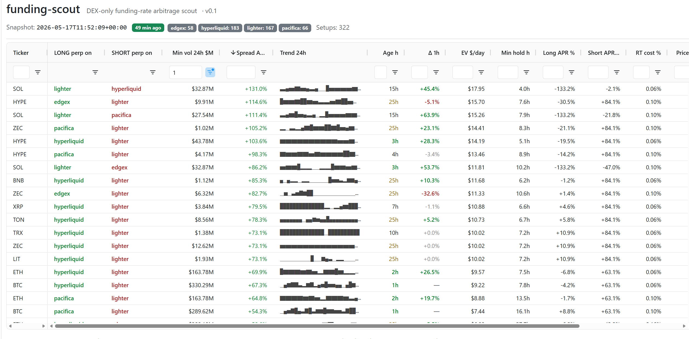

# funding-scout

DEX-only funding-rate arbitrage scout. **An EV calculator for funding setups, not a rate scanner.**

Most funding-rate scanners rank setups by raw APR. That number is misleading on its own: a 400% APR spread that takes 6 hours to materialise can lose money once you factor in round-trip cost, slippage on entry/exit, and the friction tax of moving capital between venues. `funding-scout` computes those costs and shows them next to the EV — so the top of the list is the top of your bankroll, not the top of an API ticker.



> **Status:** v0.1, beta. Designed for small-operator, manual-execution setups (~$5k unit size). No order routing, no private keys — funding-scout tells you where to go and why; you decide and click. Breaking changes possible before v0.2.

## Why funding-scout

The existing tooling (e.g. [fundoor.pro](https://fundoor.pro)) is built to rank funding APRs across CEX + DEX. Useful, but raw APR is a surface metric. Two setups with identical 200% APR can have wildly different EV depending on:

- **Round-trip cost** — entry + exit fees on both legs (fees differ a lot: Hyperliquid taker 0.045%, Lighter free-tier 0%, EdgeX/Pacifica higher).
- **Expected hold time** — equity-weekend setups close within hours; long-tail carry runs for weeks. The funding APR materialises only over the period you actually hold.
- **Min profitable hours** = `round-trip cost / funding APR`. If APR is 50% and round-trip cost is 0.20%, you need ~35 hours of holding just to break even. The UI surfaces this number directly.
- **Friction tax** — when capital is not already on the venues a setup needs, you pay bridging cost + slippage + gas + time. At ~$5k unit size this is often the difference between "🟢 do it" and "🟡 skip".

`funding-scout` is opinionated about one more thing: **transparent risk disclosure, not paternalistic filtering**. Risk metrics (β to majors, simulated flash-crash loss, oracle-manipulation exposure, ADL queue position) live as columns next to EV, with confidence labels (`measured` / `estimated` / `proxied`). Nothing is auto-hidden because of risk. You sort and filter; the tool does not pre-judge for you.

See [`docs/concept.md`](docs/concept.md) for the full paradigm, [`docs/strategies.md`](docs/strategies.md) for the taxonomy of 6 setup types this is designed to cover, [`docs/risk.md`](docs/risk.md) for the risk model.

## Quick look

A live scan against four DEXs:

```
$ funding-scout scan
Snapshot @ 2026-05-17T11:52:09+00:00 | venues: {'edgex': 58, 'hyperliquid': 183, 'lighter': 167, 'pacifica': 66} | setups: 322

Ticker    Long -> Short             Spread%APR  EV $/day    RT cost%   MinVol $M
--------------------------------------------------------------------------------
CHIP      lighter -> pacifica           +901.8  $+123.53        0.10        0.03
CHIP      lighter -> hyperliqui         +813.6  $+111.46        0.06        0.03
SPX       lighter -> hyperliqui         +591.9   $+81.08        0.06        0.04
STABLE    lighter -> hyperliqui         +572.2   $+78.39        0.06        0.17
EDGE      lighter -> edgex              +439.4   $+60.19        0.10        0.11
VIRTUAL   edgex -> lighter              +338.9   $+46.43        0.10        0.10
HOOD      pacifica -> edgex             +276.2   $+37.84        0.20        0.02
VIRTUAL   edgex -> pacifica             +268.0   $+36.71        0.20        0.01
VIRTUAL   edgex -> hyperliqui           +265.8   $+36.41        0.16        0.52
HOOD      lighter -> edgex              +261.4   $+35.80        0.10        0.32
...
SOL       lighter -> hyperliqui         +131.0   $+17.95        0.06       32.87
```

EV figures are computed for a standard $5k notional per leg. Pre-market and low-volume tickers are **intentionally not filtered out** — they get labelled, you decide. Notice the top of the list above: nine of the top-ten setups have `MinVol $M < $1M`. At ~$5k unit size, slippage on those wipes out the APR. The first *actually tradeable* setup is SOL with $32.87M vol at +131% APR — but you have to scroll past nine honeypots to see it.

This is by design (transparent risk disclosure, no paternalistic filtering), but in the web UI you can apply a `Min vol 24h $M ≥ 1` filter in the column header and the picture collapses to the ~50 setups you can realistically take. The screenshot above shows that filtered view. The daily Telegram digest applies the same filter automatically and tags the message with `filter: 24h vol ≥ $1M` so you always know whether you're looking at the full board or the actionable subset.

The web UI adds columns the CLI doesn't show. A **durability cluster** answers the operative question on a setup — *is this window opening, closing, or how much longer will it last*: **Trend 24h** (unicode-block sparkline of spread history), **Age h** (consecutive hours the spread has stayed ≥ 30% APR — fresh window vs steady carry), **Δ 1h** (spread change vs the previous snapshot — opening or closing right now), plus a Kaplan–Meier **survival** layer: **Est. left h** (predicted hours the *current* window will still last, from the distribution of this pair's historical window lifetimes) and **Median life h** (its typical full lifetime). Then color-coded **LONG perp on / SHORT perp on** columns that read as a literal trade instruction.

The same verdict is exposed machine-readably at **`GET /api/setups`** for a downstream operator/agent, carrying both a *descriptive* **decay/staleness** signal (has the spread fallen from its own peak — reactive) and the *predictive* survival numbers (how much longer, before it moves). See [`docs/api.md`](docs/api.md).

```bash
funding-scout web --host 127.0.0.1 --port 8050
```

## Supported venues

| Venue       | Status | Notes                                                              |
|-------------|--------|--------------------------------------------------------------------|
| Hyperliquid | ✅     | Maker 0.015% / taker 0.045%, hourly funding, deep liquidity.       |
| Lighter     | ✅     | 0% fees on free tier, equity perps, funding clamped at ±0.5%/hour. |
| Pacifica    | ✅     | Wide equity + commodity coverage, hourly funding.                  |
| EdgeX       | ⚠️     | Wide equity, no bulk ticker endpoint (N parallel HTTP requests).   |

The connector layer is plug-in: see [`src/funding_scout/connectors/`](src/funding_scout/connectors). Adding a venue is one adapter class implementing `fetch_snapshot()`. Candidates for next iterations: Paradex, Drift, Backpack, Vest, GMX, dYdX. See [`docs/exchanges.md`](docs/exchanges.md) for the full universe.

## Install

```bash
git clone https://github.com/pa111111/funding-scout-oss.git
cd funding-scout-oss

# Linux / macOS
python3.12 -m venv .venv
source .venv/bin/activate
pip install -e ".[dev]"

# Windows (PowerShell)
py -3.12 -m venv .venv
.venv\Scripts\Activate.ps1
pip install -e ".[dev]"
```

Then:

```bash
funding-scout init                   # create DB schema (idempotent)
funding-scout snapshot               # one-shot fetch from all venues
funding-scout scan                   # top-20 cross-DEX setups in terminal
funding-scout web --port 8050        # Dash UI
```

## CLI

| Command                         | What it does                                                       |
|---------------------------------|--------------------------------------------------------------------|
| `funding-scout init`            | Create / migrate DB schema. Idempotent.                            |
| `funding-scout snapshot`        | Pull one snapshot from every connector and persist it.             |
| `funding-scout snapshot --loop 3600` | Run forever, snapshotting every N seconds (systemd-friendly).  |
| `funding-scout scan`            | Run the cross-DEX same-ticker detector on the latest snapshot.     |
| `funding-scout web`             | Launch the Dash UI (filters, sortable columns, all risk metrics).  |
| `funding-scout daily-report`    | Send a top-N report to Telegram.                                   |
| `funding-scout status`          | Row counts and last-seen timestamp per venue.                      |

## Configuration

All configuration via environment variables (a `.env` in the repo root is auto-loaded):

| Variable                              | Default                              | Notes                                       |
|---------------------------------------|--------------------------------------|---------------------------------------------|
| `DATABASE_URL`                        | `sqlite:///data/funding-scout.db`    | Postgres URL for production.                |
| `LOG_LEVEL`                           | `INFO`                               | `DEBUG` traces every HTTP call.             |
| `HYPERLIQUID_API`                     | `https://api.hyperliquid.xyz`        | Override per venue if needed.               |
| `FUNDING_SCOUT_WEB_HOST`              | `127.0.0.1`                          | Bind address for `web`.                     |
| `FUNDING_SCOUT_WEB_PORT`              | `8050`                               | Port for `web`.                             |
| `FUNDING_SCOUT_TELEGRAM_BOT_TOKEN`    | *(unset)*                            | Optional. Enables `daily-report`.           |
| `FUNDING_SCOUT_TELEGRAM_CHAT_ID`      | *(unset)*                            | Optional. Required if bot token is set.     |

See [`.env.example`](.env.example) for a copy-pasteable template.

## Stack

Python 3.12 vanilla, SQLAlchemy 2 (SQLite locally, Postgres in prod), `httpx` async for connectors, Dash + dash-ag-grid + Plotly for the UI, `click` for CLI, `structlog` for structured logs. Production deployment is via two `systemd` units (snapshot loop + web), reference files in [`deploy/systemd/`](deploy/systemd). See [`docs/stack.md`](docs/stack.md) for rationale (why not Anaconda, why not Streamlit, why not FastAPI).

## Layout

```
src/funding_scout/
├── connectors/      # one adapter per venue: hyperliquid, lighter, pacifica, edgex
├── detectors/       # generate setups from snapshots (cross-DEX same-ticker now,
│                    #   more on the way: correlated-pair, equity-weekend, carry)
├── ev/              # EV arithmetic + cost model (fees, slippage, friction tax)
├── survival/        # Kaplan–Meier window-survival: predicted remaining lifetime
│                    #   of a window from its history (pure, no numpy)
├── storage/         # SQLAlchemy 2 models + engine, dialect-aware upsert
│                    #   (funding_snapshot = raw, setup_snapshot = computed history)
├── snapshot/        # snapshot loop: persists raw + computed setups on the same ts
├── notify/          # Telegram delivery
├── web/             # Dash + dash-ag-grid UI + read-only GET /api/setups (docs/api.md)
├── reporting.py     # daily report payload assembly
├── config.py        # env-driven settings (pydantic-settings)
└── cli.py           # CLI entry point (click)

tests/               # 232 mocked + 5 E2E (gated FUNDING_SCOUT_E2E=1)
docs/                # framework, taxonomy, risk model, deployment notes
deploy/systemd/      # reference units (host/port via EnvironmentFile)
```

## Tests

```bash
pytest                              # 232 fast mocked tests
FUNDING_SCOUT_E2E=1 pytest tests/e2e # 5 real-API integration tests
ruff check . && ruff format --check .
```

CI runs both lint and the mocked suite on every push: [`.github/workflows/test.yml`](.github/workflows/test.yml).

## Docs

- [`docs/concept.md`](docs/concept.md) — paradigm: EV calculator vs rate scanner, why DEX-only, transparent risk disclosure.
- [`docs/strategies.md`](docs/strategies.md) — taxonomy of 6 setup types (cross-DEX same-ticker, equity weekend, correlated pair, sniping, long-tail carry, cash-and-carry).
- [`docs/risk.md`](docs/risk.md) — risk framework: β, slippage estimation, DEX-specific risks (smart-contract, oracle, ADL, pre-market), the Oct 2025 flash-crash benchmark.
- [`docs/execution.md`](docs/execution.md) — manual execution model, $5k unit, capital state + friction tax as first-class concepts.
- [`docs/positions.md`](docs/positions.md) — operational rules for opening, holding, closing (isolated margin, equal contracts, hybrid limit/market, market stops, 2–3x leverage).
- [`docs/exchanges.md`](docs/exchanges.md) — venue universe, integrated and candidates.
- [`docs/stack.md`](docs/stack.md) — tech choices and rationale.
- [`docs/api.md`](docs/api.md) — read-only `GET /api/setups` JSON contract: the stable `candidate_id`, the descriptive **decay/staleness** signal, the predictive Kaplan–Meier **survival** signal, and the `setup_snapshot` history table.

> Some docs are still bilingual (the framework was developed in Russian, English translation is in progress). The README and code are English-first.

## License

MIT — see [LICENSE](LICENSE). Copyright © 2026 Pavel Artamokhov.

## Contact

Issues and PRs welcome at [github.com/pa111111/funding-scout-oss](https://github.com/pa111111/funding-scout-oss).
